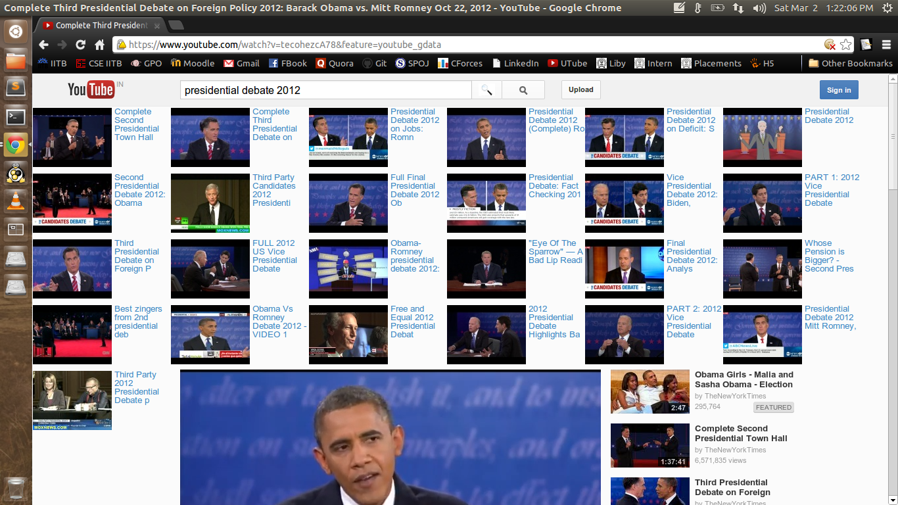

Youtube Search Bar
=======
Smoother search in Youtube...

---
This chrome extension helps you have a smoother search experience on Youtube. Lets say, you are watching a video on Youtube,
and want to see videos related to some other subject/query. Using the default search on Youtube redirects you to a different
page containing the search results, thus affecting your viewing experience. 

This chrome extension facilitates a better search experience, by displaying the top 25 results for a query on the same page,
without affecting the current running video.

**Work is in progress. The GUI is not yet ready.**

Usage
-----
1. Install the extension as explained below.
2. Whenever you load a page on www.youtube.com, a new button is loaded to the immediate right of the search input box.
3. Enter your query in the search input box, and then click on this new button instead of the default search button.
4. The results are displayed in the same page.
5. **Note that enter key is not yet supported by this extension**. i.e. clicking enter will load results in a different page.
6. Given below is a sample screenshot of the new search experience.

Requirements
------------
This extension uses the tab api. **It does not save or keep track of your browsing history**.

Installation
------------
To use this extension follow the steps given below.

1. Download the source code.
2. Extract the folder.
3. Go to chrome://chrome/extensions/
4. Select the "Developer mode" option if it has not yet been selected.
5. Then click on "Load unpacked extension...".
6. Go to the extracted directory in the dialog box that appears and click open.
7. Select "Allow in incognito mode" if you want the extension in incognito mode as well (see Requirements section above).
